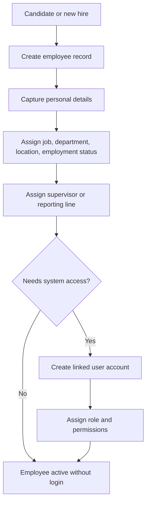
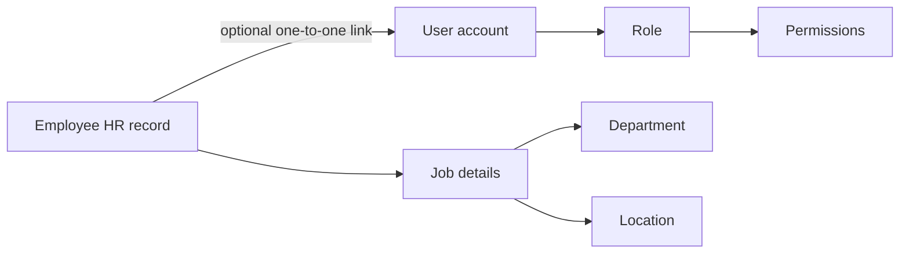
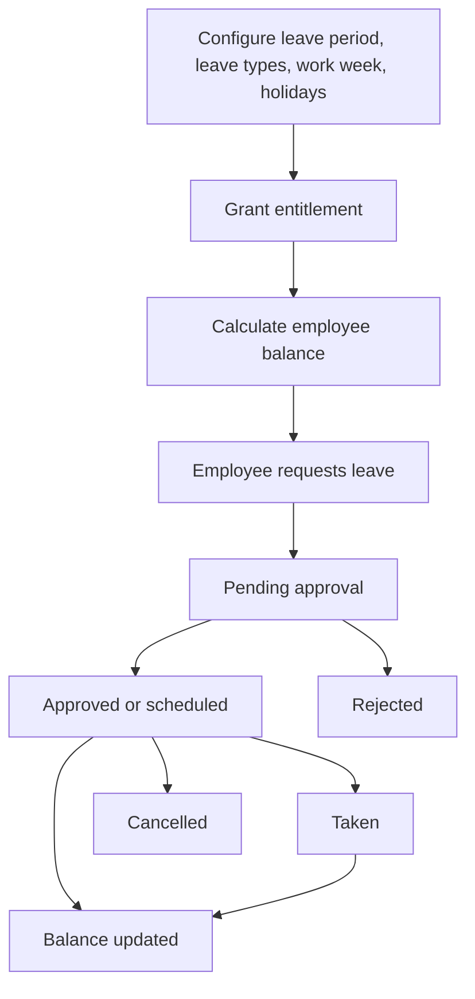
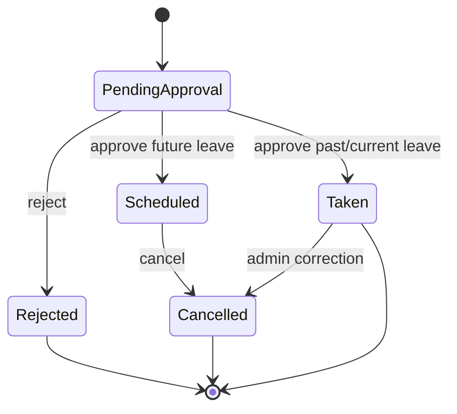
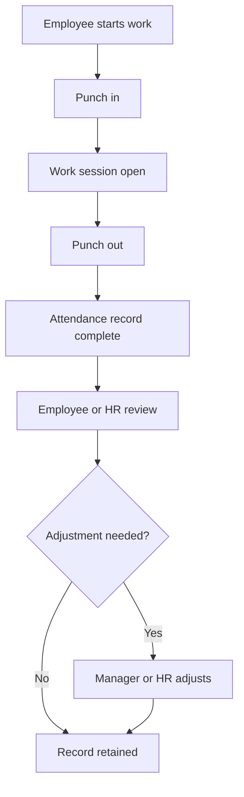
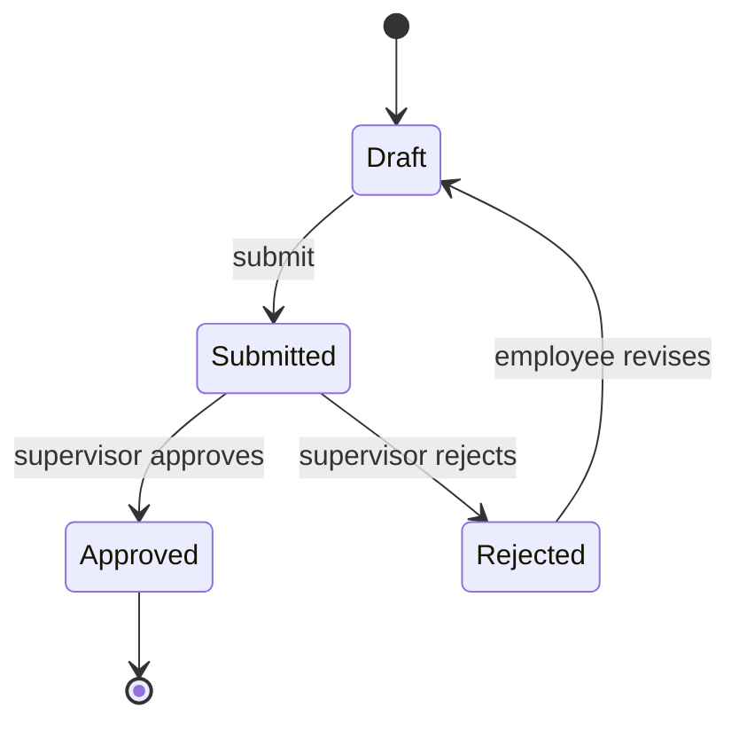
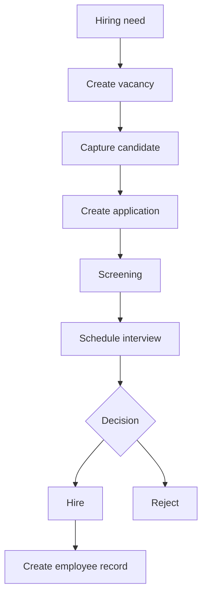
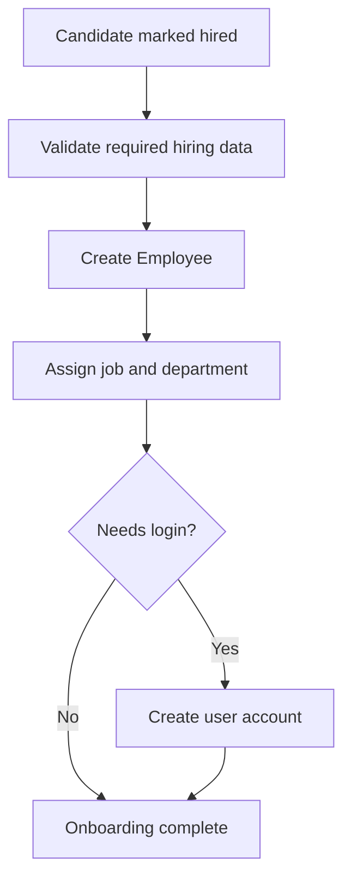
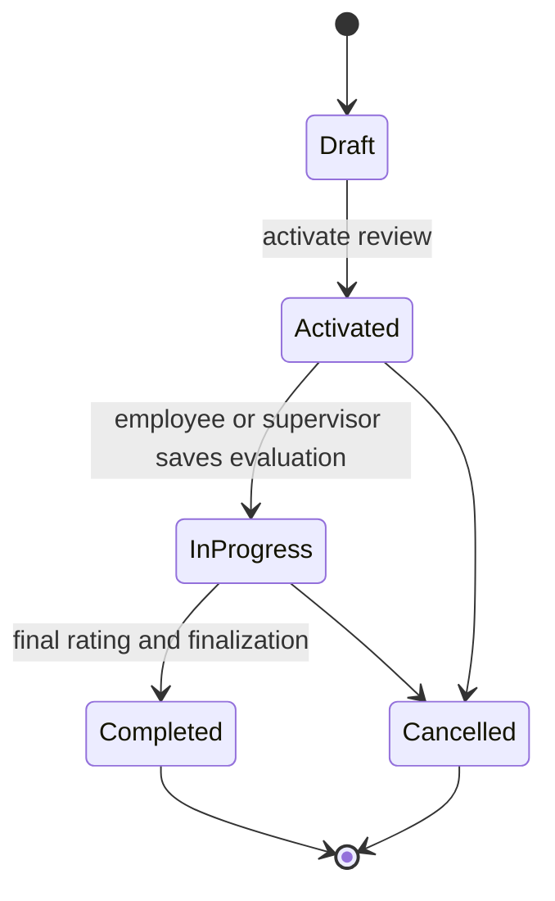

# HRM Workflows

## Employee Onboarding Workflow

## User Account and Employee Relationship

An employee record represents a person in HR. A user account represents login access. They are intentionally separate because not every employee needs application access.

## Leave Request Workflow

## Leave Approval Workflow

## Attendance Workflow

Attendance records time presence. They are not the same as project or activity work allocation.

## Timesheet Workflow

Timesheets capture work effort by period, project, and activity. They remain separate from attendance punch records.

## Recruitment Workflow

## Candidate-To-Employee Workflow

## Performance Review Workflow

KPIs are definitions, goals are target outcomes, performance reviews are evaluation events, and appraisals are finalized assessment records or cycles.
