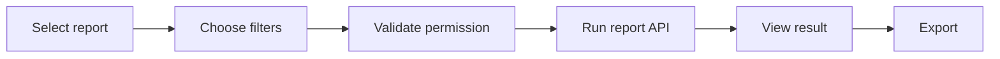
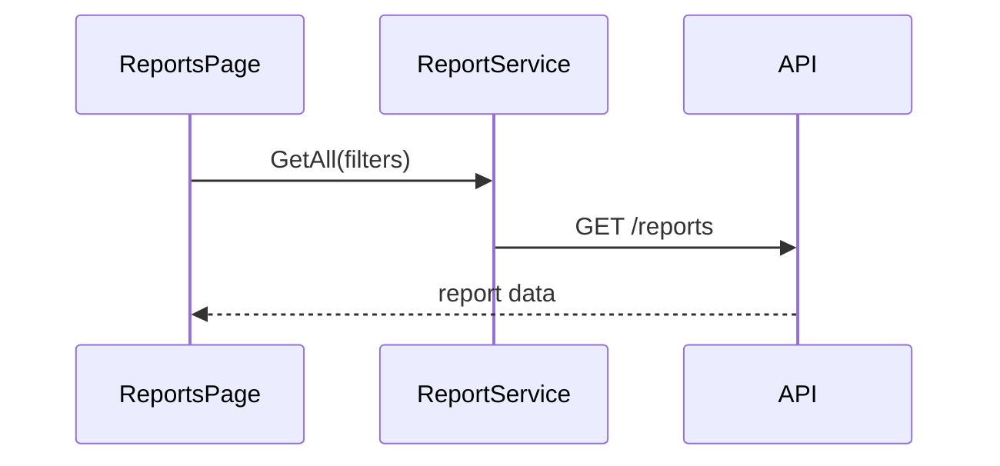

# Khai thác báo cáo HRM

Reports tổng hợp dữ liệu theo permission, branch, department và kỳ báo cáo.

## Business rules

- Export dùng cùng phạm vi quyền với màn hình
- Báo cáo chấm công dùng timesheet đã công nhận
- Dữ liệu nhạy cảm cần permission riêng
- Request export lớn chạy bất đồng bộ và lưu audit

## API flow

## Luồng liên quan

Reports tiêu thụ dữ liệu từ [[Tổ chức/Tổ chức - Index]], [[Nhân viên/Nhân viên - Index]], [[Nghỉ phép/Nghỉ phép - Index]], [[Thời gian/Thời gian - Index]], [[Tuyển dụng/Tuyển dụng - Index]] và [[Hiệu suất/Hiệu suất - Index]]. Permission scope lấy từ [[Quản trị hệ thống/Quản trị hệ thống - Index]].

[[Hospital HRM - Index]]
