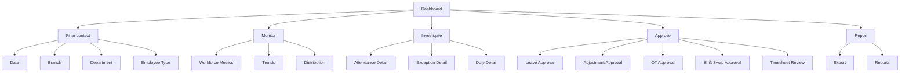
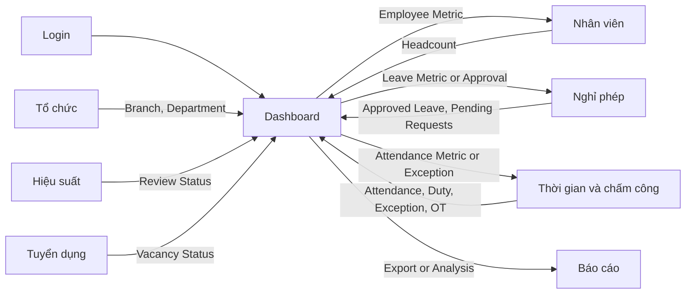
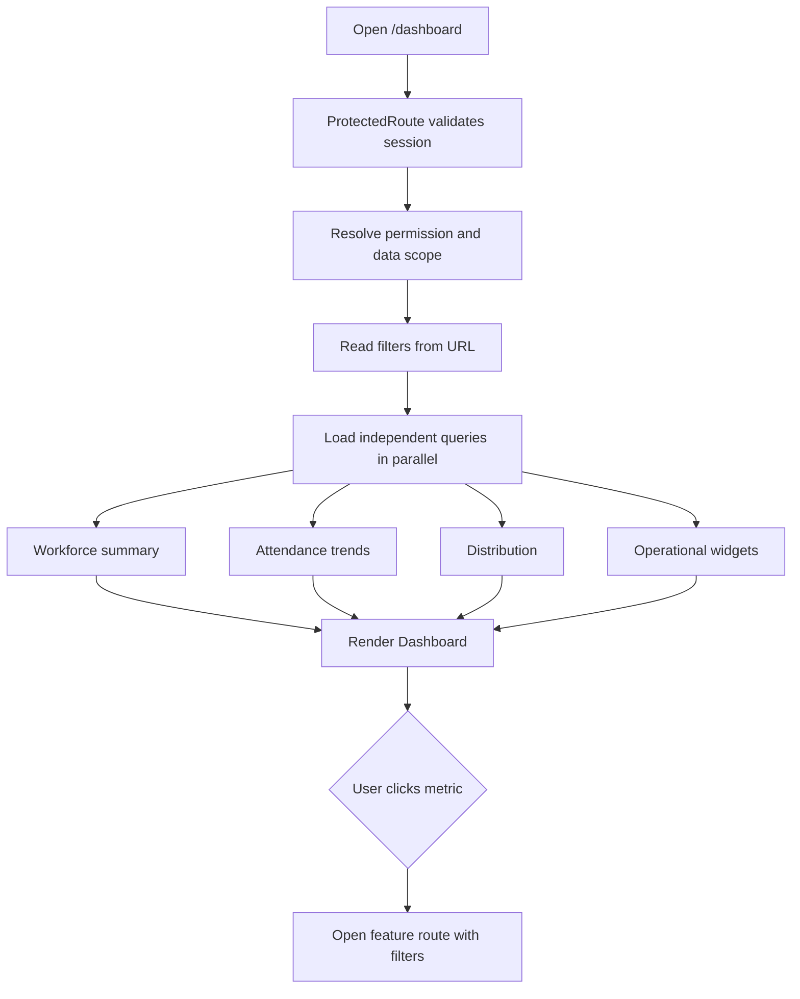
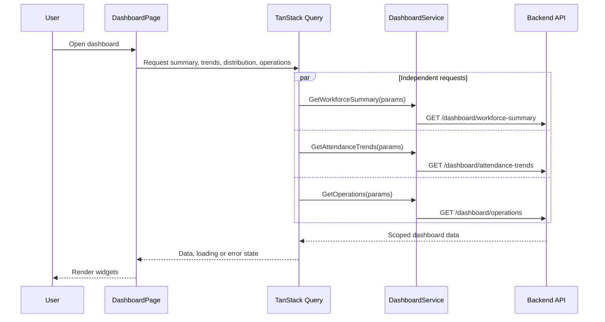
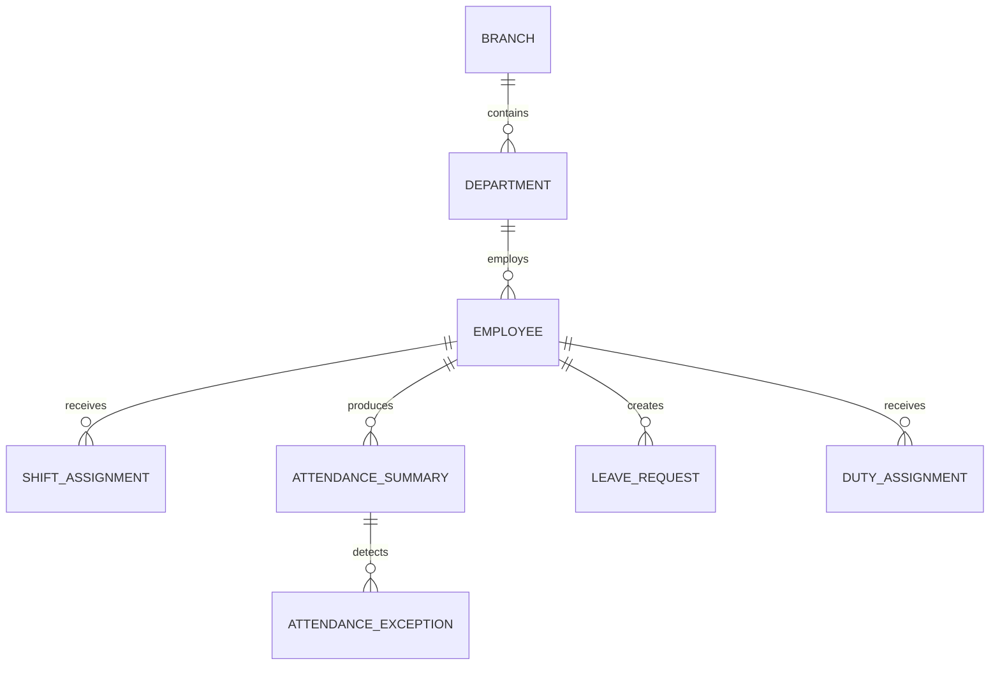

# Theo dõi vận hành từ bảng điều khiển

Dashboard giúp HR, quản lý và lãnh đạo theo dõi lực lượng lao động trong phạm vi được cấp quyền. Màn hình tổng hợp dữ liệu từ Employee, Leave, Attendance, Recruitment và Performance nhưng không trở thành source of truth của các domain đó.

## Phạm vi nghiệp vụ

Dashboard trả lời các câu hỏi sau:

- Hôm nay có bao nhiêu nhân viên đang làm việc?
- Bao nhiêu người nghỉ phép, vắng mặt, đi muộn hoặc đang trực?
- Có bao nhiêu ngoại lệ cần xử lý?
- Có yêu cầu nào đang chờ người dùng phê duyệt?
- Headcount thay đổi thế nào theo khoa phòng và chi nhánh?
- Các vị trí tuyển dụng và chu kỳ đánh giá đang ở trạng thái nào?

## Actor và permission

| Actor | Phạm vi dữ liệu | Permission tối thiểu |
|---|---|---|
| Employee | Dữ liệu cá nhân và thông báo của mình | `DASHBOARD_VIEW` |
| Manager | Nhân viên thuộc team được quản lý | `DASHBOARD_VIEW`, `attendance.view_team` |
| Head Nurse | Điều dưỡng thuộc khoa phụ trách | `DASHBOARD_VIEW`, `attendance.view_team` |
| HR | Toàn bộ nhân sự trong phạm vi chi nhánh | `DASHBOARD_VIEW`, `attendance.view_all` |
| HR Manager | Toàn tổ chức theo phạm vi được cấp | `DASHBOARD_VIEW`, `REPORT_VIEW` |
| Admin | Cấu hình và trạng thái hệ thống | `SYSTEM_ADMIN` |

Dashboard không kiểm tra role string trong component. Backend xác định data scope từ permission và assignment của người dùng.

## Chức năng màn hình

## Danh mục chức năng và liên kết màn hình

Bảng này là nguồn chính để triển khai Dashboard. Mỗi dòng mô tả một chức năng, API cần dùng và màn hình tiếp nhận khi người dùng drill-down.

| ID | Chức năng Dashboard | Người dùng thực hiện | API cần gọi | Màn hình liên kết | Chức năng tại màn hình đích |
|---|---|---|---|---|---|
| `DB-01` | Chọn ngày vận hành | Chọn một ngày cần theo dõi | Gửi `date` vào toàn bộ Dashboard API | Không chuyển màn hình | Reload mọi metric, chart và widget theo ngày |
| `DB-02` | Chọn chi nhánh | Chọn Branch trong phạm vi quyền | `GET /organizations/locations` | [[Tổ chức/Tổ chức - Index]] | Quản lý Branch và Location dùng làm danh mục lọc |
| `DB-03` | Chọn khoa phòng | Chọn Department thuộc Branch | `GET /organizations/departments?branchId=:id` | [[Tổ chức/Tổ chức - Index]] | Quản lý Department và quan hệ trực thuộc |
| `DB-04` | Xem tổng nhân viên | Click Total Employees | `GET /dashboard/workforce-summary` | [[Nhân viên/Nhân viên - Index]] `/employees` | Mở Employee List với `status=ACTIVE` và filter hiện tại |
| `DB-05` | Xem nhân viên có mặt | Click Present Today | `GET /dashboard/workforce-summary` | [[Thời gian/Thời gian - Index]] `/workforce-attendance/daily` | Lọc Daily Attendance theo `PRESENT` |
| `DB-06` | Xem nhân viên vắng | Click Absent | `GET /dashboard/workforce-summary` | [[Thời gian/Thời gian - Index]] `/workforce-attendance/daily` | Lọc theo `ABSENT`, cho phép mở Attendance Detail |
| `DB-07` | Xem đi muộn | Click Late | `GET /dashboard/workforce-summary` | [[Thời gian/Thời gian - Index]] `/workforce-attendance/daily` | Lọc `LATE`, xem late minutes và policy |
| `DB-08` | Xem về sớm | Click Early Leave | `GET /dashboard/workforce-summary` | [[Thời gian/Thời gian - Index]] `/workforce-attendance/daily` | Lọc `EARLY_LEAVE`, mở calculation detail |
| `DB-09` | Xem nghỉ phép | Click On Leave | `GET /dashboard/workforce-summary` | [[Nghỉ phép/Lịch nghỉ]] `/leave/calendar` | Hiển thị leave đã duyệt trong ngày |
| `DB-10` | Xem trực tại viện | Click On Duty | `GET /dashboard/operations` | [[Thời gian/Thời gian - Index]] `/workforce-attendance/duty` | Lọc `ON_SITE_DUTY` đang hiệu lực |
| `DB-11` | Xem nhân viên on-call | Click On-call | `GET /dashboard/operations` | [[Thời gian/Thời gian - Index]] `/workforce-attendance/duty` | Lọc `ON_CALL`, xem call-back liên quan |
| `DB-12` | Xem ca đêm | Click Night Shift | `GET /dashboard/operations` | [[Thời gian/Thời gian - Index]] `/workforce-attendance/schedules` | Lọc Shift Type `NIGHT` và `OVERNIGHT` |
| `DB-13` | Xử lý thiếu check-in | Click Missing Check-in | `GET /dashboard/operations` | [[Thời gian/Thời gian - Index]] `/workforce-attendance/exceptions` | Lọc `MISSING_CHECK_IN`, tạo Adjustment |
| `DB-14` | Xử lý thiếu check-out | Click Missing Check-out | `GET /dashboard/operations` | [[Thời gian/Thời gian - Index]] `/workforce-attendance/exceptions` | Lọc `MISSING_CHECK_OUT`, tạo Adjustment |
| `DB-15` | Phân tích xu hướng attendance | Click ngày trên chart | `GET /dashboard/attendance-trends` | [[Thời gian/Thời gian - Index]] `/workforce-attendance/daily` | Mở ngày được chọn với status tương ứng |
| `DB-16` | Phân tích OT | Click điểm Overtime Trend | `GET /dashboard/attendance-trends` | [[Thời gian/Thời gian - Index]] `/workforce-attendance/overtime` | Lọc request và actual OT theo ngày |
| `DB-17` | Phân tích theo Department | Click một Department | `GET /dashboard/attendance-distribution` | [[Thời gian/Thời gian - Index]] `/workforce-attendance/daily` | Giữ `departmentId`, mở danh sách chi tiết |
| `DB-18` | Phân tích theo Branch | Click một Branch | `GET /dashboard/attendance-distribution` | [[Thời gian/Thời gian - Index]] `/workforce-attendance/daily` | Giữ `branchId`, mở danh sách chi tiết |
| `DB-19` | Mở ngoại lệ nghiêm trọng | Click một exception | `GET /dashboard/operations` | [[Thời gian/Thời gian - Index]] `/workforce-attendance/exceptions/:id` | Xem log, calculation, workflow và Resolve |
| `DB-20` | Mở nhân viên đang trực | Click một duty assignment | `GET /dashboard/operations` | [[Thời gian/Thời gian - Index]] `/workforce-attendance/duty/:id/edit` | Xem hoặc cập nhật Duty Assignment theo quyền |
| `DB-21` | Duyệt Leave | Click pending Leave | `GET /dashboard/pending-approvals` | [[Nghỉ phép/Yêu cầu nghỉ phép]] `/leave/requests` | Mở request đang chờ Manager Approval |
| `DB-22` | Duyệt Attendance Adjustment | Click pending Adjustment | `GET /dashboard/pending-approvals` | [[Thời gian/Thời gian - Index]] `/workforce-attendance/adjustments` | Mở Approval Queue hoặc Request Detail |
| `DB-23` | Duyệt Overtime | Click pending OT | `GET /dashboard/pending-approvals` | [[Thời gian/Thời gian - Index]] `/workforce-attendance/overtime` | Lọc `PENDING`, mở approve/reject |
| `DB-24` | Duyệt đổi ca | Click pending Shift Swap | `GET /dashboard/pending-approvals` | [[Thời gian/Thời gian - Index]] `/workforce-attendance/shift-swaps` | Xem acceptance, conflict và manager approval |
| `DB-25` | Review Timesheet | Click pending Timesheet | `GET /dashboard/pending-approvals` | [[Thời gian/Thời gian - Index]] `/workforce-attendance/timesheets` | Lọc kỳ công chờ review |
| `DB-26` | Xuất Dashboard | Click Export | `POST /dashboard/exports` | [[Báo cáo]] `/reports` | Theo dõi export job và tải file |
| `DB-27` | Làm mới dữ liệu | Click Refresh | Refetch các Dashboard query | Không chuyển màn hình | Giữ filter, cập nhật `asOf` |

### Quy tắc truyền filter khi chuyển màn hình

Dashboard phải giữ context khi điều hướng. Route đích nhận các query parameter sau:

```text
date=2026-07-15
branchId=branch_id
departmentId=department_id
employeeType=employee_type
status=PRESENT
source=dashboard
```

Ví dụ khi click metric Late:

```text
/workforce-attendance/daily
?date=2026-07-15
&branchId=branch_id
&departmentId=department_id
&status=LATE
&source=dashboard
```

Màn hình đích đọc query parameter, khởi tạo filter và cho phép quay lại Dashboard mà không mất context.

## Nhóm chức năng theo mục đích



## Screen flow giữa Dashboard và các phân hệ



## Permission theo chức năng

| Chức năng | Permission |
|---|---|
| Mở Dashboard | `DASHBOARD_VIEW` |
| Xem dữ liệu cá nhân | `attendance.view_self` |
| Xem team | `attendance.view_team` |
| Xem toàn phạm vi | `attendance.view_all` |
| Mở Employee List | `EMPLOYEE_VIEW` |
| Xem Leave | `LEAVE_VIEW` |
| Duyệt Leave | `LEAVE_APPROVE` |
| Duyệt Adjustment cấp Manager | `attendance.approve_manager` |
| Duyệt Adjustment cấp HR | `attendance.approve_hr` |
| Review Timesheet | `timesheet.review` |
| Xem báo cáo | `REPORT_VIEW` |

Nếu người dùng thấy metric nhưng không có permission mở danh sách chi tiết, metric không được render như một link.

### Bộ lọc chung

| Filter | Kiểu | Giá trị mặc định | Ảnh hưởng |
|---|---|---|---|
| Date | Date | Ngày hiện tại theo timezone bệnh viện | Attendance, leave, duty |
| Branch | Select | Chi nhánh hiện tại hoặc tất cả được phép | Toàn bộ widget |
| Department | Select | Tất cả khoa phòng được phép | Toàn bộ widget |
| Employee type | Select | Tất cả | Workforce metrics |

Filter được đồng bộ lên URL query để người dùng bookmark và chia sẻ trạng thái màn hình.

### Workforce summary

| Metric | Ý nghĩa | Source of truth | Điều hướng khi click |
|---|---|---|---|
| Total Employees | Nhân viên active tại ngày lọc | Employee | `/employees` |
| Present Today | Có attendance được công nhận | Attendance Summary | `/workforce-attendance/daily?status=PRESENT` |
| Absent | Có lịch nhưng không có attendance/leave hợp lệ | Attendance Summary | `/workforce-attendance/daily?status=ABSENT` |
| Late | Đi muộn theo policy có hiệu lực | Attendance Summary | `/workforce-attendance/daily?status=LATE` |
| Early Leave | Về sớm theo policy | Attendance Summary | `/workforce-attendance/daily?status=EARLY_LEAVE` |
| On Leave | Leave đã duyệt | Leave | `/leave/calendar` |
| On Duty | Đang trực tại viện | Duty Assignment | `/workforce-attendance/duty` |
| On-call | Đang trong phiên on-call | Duty Assignment | `/workforce-attendance/duty?type=ON_CALL` |
| Night Shift | Được phân ca đêm | Schedule | `/workforce-attendance/schedules` |
| Missing Check-in | Thiếu log vào | Attendance Exception | `/workforce-attendance/exceptions?type=MISSING_CHECK_IN` |
| Missing Check-out | Thiếu log ra | Attendance Exception | `/workforce-attendance/exceptions?type=MISSING_CHECK_OUT` |

### Biểu đồ

| Chart | Dữ liệu | Granularity | Tương tác |
|---|---|---|---|
| Attendance trend | Present, absent, leave | Ngày | Chọn điểm để mở Daily Attendance |
| Late trend | Số lượt và tổng phút đi muộn | Ngày | Lọc ngoại lệ Late |
| Overtime trend | OT requested, approved, actual | Ngày hoặc tuần | Mở Overtime list |
| Attendance by Department | Present/total theo department | Department | Lọc theo department |
| Attendance by Branch | Present/total theo branch | Branch | Lọc theo branch |
| Status distribution | Tỷ trọng attendance status | Status | Lọc Daily Attendance |

### Operational widgets

#### Today's Workforce

Hiển thị tổng nhân sự theo lịch, có mặt, nghỉ phép, trực, on-call và chưa xác định trạng thái.

#### Attendance Exceptions

Hiển thị ngoại lệ `CRITICAL` và `HIGH` trước. Mỗi item liên kết đến Attendance Exception Detail.

#### Employees Currently On Duty

Hiển thị nhân viên đang trực, khoa phòng, loại trực, thời gian kết thúc và vị trí.

#### Current Night Shift

Hiển thị nhân viên thuộc ca đêm đang hiệu lực, trạng thái check-in và số giờ đã làm.

#### Pending Approval Requests

Tổng hợp Leave, Attendance Adjustment, Overtime, Shift Swap và Timesheet đang chờ người dùng hiện tại.

## API cần cho Dashboard

Các endpoint dưới đây là API backend cần cung cấp. Repository hiện chưa có nhóm `DASHBOARD` trong `api-endpoints.ts`.

### Lấy summary

```http
GET /dashboard/workforce-summary?date=2026-07-15&branchId=branch_id&departmentId=department_id&employeeType=employee_type
```

```json
{
  "asOf": "2026-07-15T10:30:00+07:00",
  "totalEmployees": 286,
  "present": 241,
  "absent": 7,
  "late": 18,
  "earlyLeave": 4,
  "onLeave": 16,
  "onDuty": 22,
  "onCall": 9,
  "nightShift": 38,
  "missingCheckIn": 5,
  "missingCheckOut": 7
}
```

### Lấy trend

```http
GET /dashboard/attendance-trends?from=2026-07-09&to=2026-07-15&branchId=branch_id&groupBy=DAY
```

```json
{
  "items": [
    {
      "date": "2026-07-15",
      "present": 241,
      "absent": 7,
      "late": 18,
      "overtimeMinutes": 1374
    }
  ]
}
```

### Lấy distribution

```http
GET /dashboard/attendance-distribution?date=2026-07-15&dimension=DEPARTMENT&branchId=branch_id
```

```json
{
  "items": [
    {
      "dimensionId": "department_id",
      "dimensionName": "Hồi sức tích cực",
      "scheduled": 42,
      "present": 38,
      "absent": 1,
      "onLeave": 3
    }
  ]
}
```

### Lấy operational widgets

```http
GET /dashboard/operations?date=2026-07-15&branchId=branch_id&departmentId=department_id
```

Response gồm các collection có giới hạn:

```json
{
  "criticalExceptions": [],
  "employeesOnDuty": [],
  "currentNightShift": [],
  "pendingApprovals": {
    "leave": 4,
    "attendanceAdjustments": 7,
    "overtime": 3,
    "shiftSwaps": 2,
    "timesheets": 12
  }
}
```

### Lấy filter options

Dashboard tái sử dụng API Organization thay vì tạo danh mục trùng:

```text
GET /organizations/locations
GET /organizations/departments
```

## Frontend service cần bổ sung

```typescript
class DashboardService {
  static GetWorkforceSummary = (params: DashboardFilterParams) =>
    api.get<WorkforceSummary>(
      API_ENDPOINTS.DASHBOARD.WORKFORCE_SUMMARY,
      params,
    );

  static GetAttendanceTrends = (params: DashboardTrendParams) =>
    api.get<AttendanceTrendResponse>(
      API_ENDPOINTS.DASHBOARD.ATTENDANCE_TRENDS,
      params,
    );

  static GetOperations = (params: DashboardFilterParams) =>
    api.get<DashboardOperations>(
      API_ENDPOINTS.DASHBOARD.OPERATIONS,
      params,
    );
}
```

## Query keys

```typescript
export const dashboardKeys = {
  all: ['dashboard'] as const,
  summary: (params: DashboardFilterParams) =>
    [...dashboardKeys.all, 'summary', params] as const,
  trends: (params: DashboardTrendParams) =>
    [...dashboardKeys.all, 'trends', params] as const,
  operations: (params: DashboardFilterParams) =>
    [...dashboardKeys.all, 'operations', params] as const,
};
```

## Luồng tổng thể



## API sequence



## Quan hệ dữ liệu



Dashboard không lưu bản sao các entity trên. API tổng hợp dữ liệu theo thời điểm và permission scope.

## Trạng thái giao diện

| State | Hành vi |
|---|---|
| Loading | Skeleton theo đúng kích thước metric, chart và widget |
| Partial loading | Widget đã có dữ liệu hiển thị trước |
| Empty | Giải thích không có dữ liệu trong phạm vi filter |
| Partial error | Hiển thị lỗi tại widget, không làm hỏng toàn Dashboard |
| Unauthorized | Hiển thị Permission State hoặc Access Denied |
| Stale | Giữ dữ liệu cũ trong lúc refetch và hiển thị thời điểm cập nhật |

## Quy tắc hiệu năng

- Gọi các API độc lập song song
- Không tải danh sách đầy đủ nếu widget chỉ cần tổng số
- API widget giới hạn số item trả về
- Query cache theo filter
- Không đưa dữ liệu Dashboard vào Zustand
- Chart nặng được lazy load nếu không nằm trong viewport đầu tiên

## Acceptance criteria

- [ ] Dashboard chỉ hiển thị dữ liệu trong permission scope
- [ ] Filter áp dụng đồng nhất cho các widget
- [ ] Filter được lưu trên URL
- [ ] Metric liên kết tới đúng feature route và giữ filter
- [ ] API được gọi qua DashboardService
- [ ] Các query độc lập chạy song song
- [ ] Một widget lỗi không làm hỏng widget khác
- [ ] Loading, empty, error và permission state đầy đủ
- [ ] Số liệu hiển thị thời điểm cập nhật
- [ ] Dashboard không trở thành source of truth

## Source map hiện tại

- `src/components/dashboard/DashboardPage.tsx`
- `src/app/router.tsx`
- `src/config/navigation.ts`
- `src/config/permissions.ts`

## Khoảng trống cần triển khai

- Thêm `API_ENDPOINTS.DASHBOARD`
- Tạo `DashboardService.ts`
- Tạo `dashboard.query.ts`
- Thêm dashboard types
- Thay số liệu demo bằng API response
- Bổ sung drill-down giữ nguyên filter

## Luồng liên quan

- [[Login]]: tạo session và permission context
- [[Tổ chức/Tổ chức - Index]]: cung cấp Branch và Department filter
- [[Nhân viên/Nhân viên - Index]]: cung cấp headcount
- [[Nghỉ phép/Nghỉ phép - Index]]: cung cấp số nhân viên nghỉ
- [[Thời gian/Thời gian - Index]]: cung cấp attendance và exception metrics
- [[Báo cáo]]: cung cấp drill-down và export

[[Hospital HRM - Index]]
