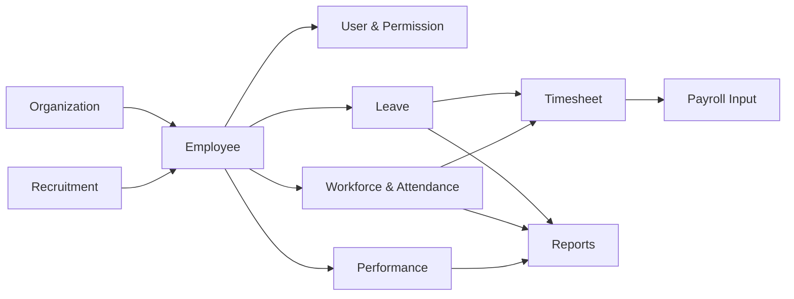
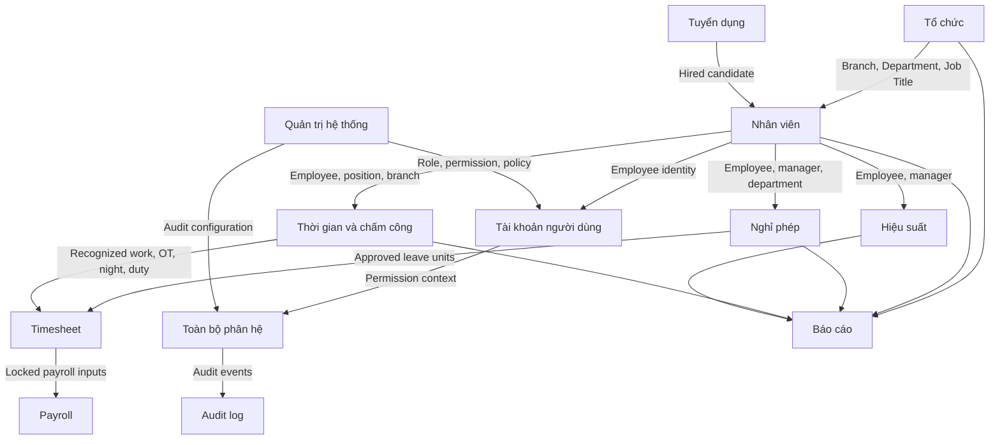
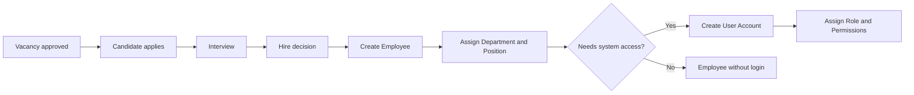
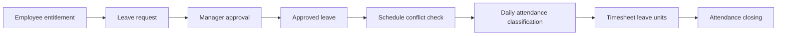
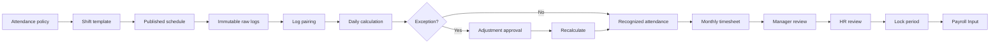
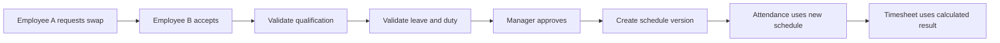
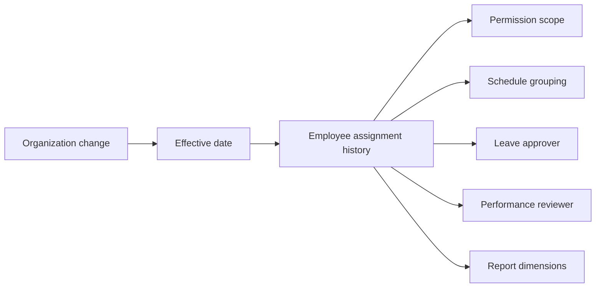

# Hospital HRM documentation

Tài liệu này là bản đồ nghiệp vụ và kỹ thuật của Hospital HRM. Mỗi liên kết mở một đặc tả độc lập gồm business rules, screen flow, Application Programming Interface (API) flow và Entity Relationship Diagram (ERD).

## Luồng nghiệp vụ tổng thể



## Quan hệ giữa các phân hệ

Sơ đồ này chỉ rõ phân hệ nào tạo dữ liệu nguồn và phân hệ nào tiêu thụ dữ liệu đó.



### Dependency matrix

| Phân hệ | Nhận dữ liệu từ | Cung cấp dữ liệu cho | Không được thay thế |
|---|---|---|---|
| Tổ chức | Quản trị hệ thống | Nhân viên, Leave, Attendance, Reports | Hồ sơ nhân viên |
| Nhân viên | Tổ chức, Tuyển dụng | User, Leave, Attendance, Performance | Tài khoản đăng nhập |
| Tài khoản | Nhân viên, Administration | Auth, Permission Guard, Audit | Employee |
| Nghỉ phép | Employee, Leave Policy | Schedule, Timesheet, Reports | Attendance raw log |
| Schedule | Employee, Shift, Leave, Duty | Attendance calculation | Attendance thực tế |
| Attendance | Schedule, Raw Log, Policy | Exception, Timesheet | Timesheet hoặc Payroll Input |
| Timesheet | Attendance, Leave, OT, Duty | Closing, Payroll Input, Reports | Raw Attendance |
| Recruitment | Organization, Vacancy | Employee | Employee trước khi Hire |
| Performance | Employee, KPI | Reports | Payroll calculation trực tiếp |
| Reports | Các domain đã chốt | Người dùng được cấp quyền | Source of truth của domain |
| Administration | User, Role, Permission | Mọi route và action | Authorization phía backend |

## Các hành trình xuyên phân hệ

Các hành trình dưới đây mô tả điểm bắt đầu, dữ liệu trung gian và kết quả cuối cùng.

### Tuyển dụng đến nhân viên hoạt động



Liên kết tài liệu: [[Tuyển dụng/Tuyển dụng - Index]] → [[Tổ chức/Tổ chức - Index]] → [[Nhân viên/Nhân viên - Index]] → [[Tài khoản người dùng/Tài khoản người dùng - Index]].

### Nhân viên nghỉ phép đến bảng công



Liên kết tài liệu: [[Nghỉ phép/Nghỉ phép - Index]] → [[Thời gian/Thời gian - Index]] → [[Báo cáo]].

### Phân ca đến Payroll Input



Liên kết tài liệu: [[Tổ chức/Tổ chức - Index]] → [[Nhân viên/Nhân viên - Index]] → [[Thời gian/Thời gian - Index]] → [[Báo cáo]].

### Đổi ca ảnh hưởng chấm công



Schedule cũ vẫn tồn tại trong lịch sử. Attendance chỉ dùng schedule version có hiệu lực tại thời điểm tính.

### Thay đổi tổ chức ảnh hưởng hệ thống



Thay đổi Department không được ghi đè lịch sử. Báo cáo quá khứ dùng assignment có hiệu lực tại ngày báo cáo.

## Source of truth

Mỗi loại dữ liệu chỉ có một nguồn chính. Các phân hệ khác tham chiếu bằng ID và version.

| Dữ liệu | Source of truth | Consumer |
|---|---|---|
| Branch, Department, Job Title | Organization | Employee, Schedule, Reports |
| Employee identity | Employee | Mọi domain nghiệp vụ |
| Login identity | User Account | Authentication, Audit |
| Permission | Administration | Frontend guard, Backend authorization |
| Leave entitlement và balance | Leave | Request validation, Timesheet |
| Published work plan | Schedule | Attendance calculation |
| Thiết bị ghi nhận | Raw Attendance Log | Attendance calculation, Audit |
| Thời gian được công nhận theo ngày | Attendance Summary | Timesheet |
| Công được công nhận theo tháng | Timesheet | Closing, Payroll Input |
| Payroll-ready data | Payroll Input | Payroll |
| KPI và appraisal | Performance | Reports |

## Sự kiện liên phân hệ

Backend có thể phát các domain event sau để các phân hệ cập nhật mà không ghi chéo dữ liệu trực tiếp.

| Event | Phát từ | Consumer | Kết quả |
|---|---|---|---|
| `EmployeeHired` | Recruitment | Employee | Tạo hồ sơ nhân viên |
| `EmployeeAssignmentChanged` | Employee | Schedule, Leave, Reports | Cập nhật phạm vi theo ngày hiệu lực |
| `LeaveApproved` | Leave | Schedule, Attendance, Timesheet | Đánh dấu ngày nghỉ đã duyệt |
| `SchedulePublished` | Schedule | Attendance | Chọn expected shift để tính công |
| `ShiftSwapApproved` | Schedule | Attendance, Audit | Tạo schedule version mới |
| `AttendanceAdjustmentApproved` | Attendance | Attendance Calculator | Recalculate daily summary |
| `TimesheetLocked` | Timesheet | Payroll, Reports | Tạo Payroll Input bất biến |
| `PermissionChanged` | Administration | Authentication, Navigation | Refresh permission context |

## Quy tắc tích hợp

1. Domain không cập nhật trực tiếp bảng dữ liệu thuộc domain khác.
2. API response dùng ID ổn định và version khi dữ liệu có lịch sử.
3. Consumer chỉ dùng trạng thái đã duyệt hoặc đã công bố.
4. Raw log, audit log và Payroll Input là dữ liệu bất biến.
5. Mọi phép tính lưu policy version đã sử dụng.
6. Báo cáo dùng dữ liệu đã chốt khi yêu cầu số liệu chính thức.
7. Permission scope áp dụng tại API, không chỉ ở menu frontend.

## Tài liệu màn hình và phân hệ

- [[Login]]: xác thực, session, refresh token và chuyển hướng
- [[Bảng điều khiển]]: số liệu tổng quan và điều hướng vận hành
- [[Tổ chức/Tổ chức - Index]]: công ty, chi nhánh, khoa phòng và chức danh
- [[Nhân viên/Nhân viên - Index]]: hồ sơ và vòng đời nhân viên
- [[Tài khoản người dùng/Tài khoản người dùng - Index]]: tài khoản, quyền và trạng thái truy cập
- [[Nghỉ phép/Nghỉ phép - Index]]: cấu hình, entitlement, balance, request và approval
- [[Thời gian/Thời gian - Index]]: shift, schedule, attendance, timesheet và closing
- [[Tuyển dụng/Tuyển dụng - Index]]: vacancy, candidate, interview và hire
- [[Hiệu suất/Hiệu suất - Index]]: KPI, mục tiêu, review và appraisal
- [[Báo cáo]]: báo cáo vận hành và xuất dữ liệu
- [[Quản trị hệ thống/Quản trị hệ thống - Index]]: role, permission, audit và cấu hình
- [[Kiến trúc frontend và API]]: dependency flow, state và error handling

## Luồng truy cập

```mermaid
flowchart LR
  A[/login] --> B[AuthService.Login]
  B --> C[Auth store]
  C --> D[ProtectedRoute]
  D --> E[PermissionRoute]
  E --> F[DashboardLayout]
  F --> G[Feature page]
```

## Quy ước tài liệu

- Mermaid mô tả screen flow, API flow và ERD
- Tên route dùng định dạng code như `/employees`
- Tên service khớp source code
- Business rule ghi rõ điều kiện, kết quả và giới hạn
- Mỗi note liên kết ngược về [[Hospital HRM - Index]]

## Repository

`D:\luan\ctm\code\x\hrm-web`
