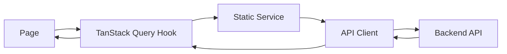

# Phát triển frontend theo kiến trúc dự án

Frontend giữ dependency flow từ Page tới Query, Service và API Client.

## State ownership

| State | Công cụ |
|---|---|
| Server data | TanStack Query |
| Auth và UI preference | Zustand |
| Business form | React Hook Form và Zod |
| Local interaction | React state |

## API rules

- Endpoint chỉ nằm trong `api-endpoints.ts`
- Page không gọi Axios hoặc `fetch`
- Public service method dùng PascalCase
- Query key dùng factory
- API error được normalize trước khi tới UI

## Source map

- `src/app/router.tsx`
- `src/config/navigation.ts`
- `src/config/permissions.ts`
- `src/api/api-client.ts`
- `src/api/api-endpoints.ts`
- `src/services/`
- `src/queries/`

## Luồng liên quan

Kiến trúc này áp dụng cho [[Login]], [[Bảng điều khiển]], [[Tổ chức/Tổ chức - Index]], [[Nhân viên/Nhân viên - Index]], [[Tài khoản người dùng/Tài khoản người dùng - Index]], [[Nghỉ phép/Nghỉ phép - Index]], [[Thời gian/Thời gian - Index]], [[Tuyển dụng/Tuyển dụng - Index]], [[Hiệu suất/Hiệu suất - Index]], [[Báo cáo]] và [[Quản trị hệ thống/Quản trị hệ thống - Index]].

[[Hospital HRM - Index]]
