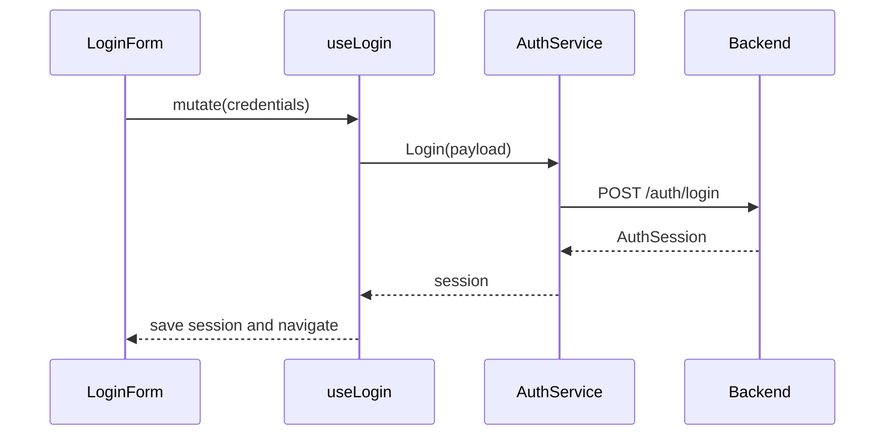
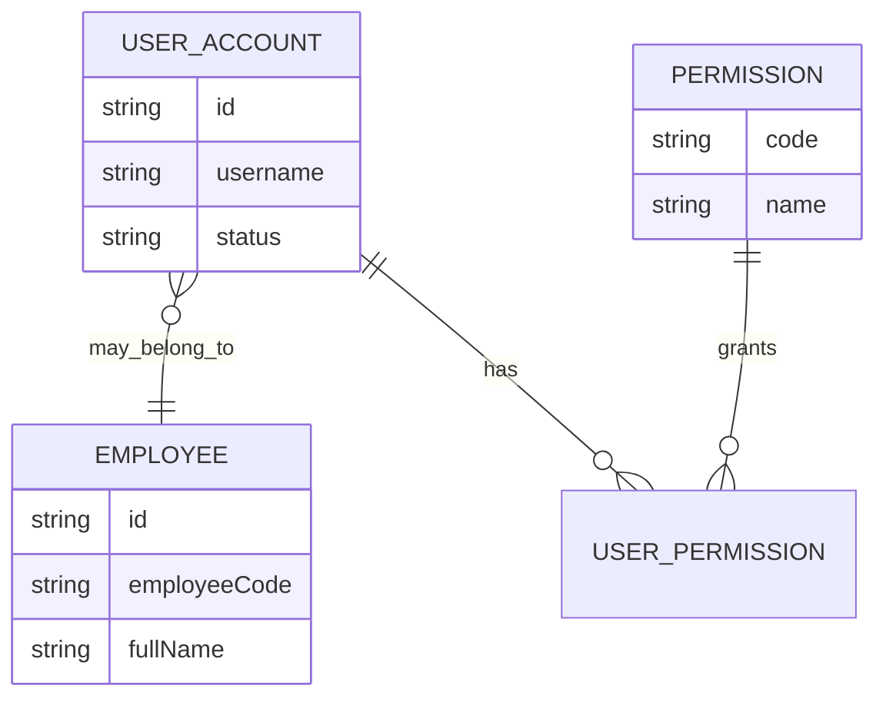

# Đăng nhập vào Hospital HRM

Màn hình `/login` xác thực tài khoản, tạo session và trả người dùng về route đã yêu cầu.

## Business rules

- Form hiển thị ngay khi mở trang
- Username và password bắt buộc
- Password không chứa khoảng trắng
- Người đã xác thực chuyển tới `/dashboard`
- Request đang chạy khóa nút Submit
- Lỗi không hiển thị chi tiết kỹ thuật

## Screen flow

```mermaid
flowchart TD
  A[Open /login] --> B{Authenticated?}
  B -- Yes --> C[/dashboard]
  B -- No --> D[Show form]
  D --> E[Validate]
  E -- Invalid --> D
  E -- Valid --> F[Submit]
  F -- Failed --> G[Show error]
  F -- Success --> H[Save session]
  H --> I[Original route or dashboard]
```

## API flow



## Data model



## Source map

- `src/components/login/LoginPage.tsx`
- `src/components/login/LoginForm.tsx`
- `src/queries/auth.query.ts`
- `src/services/AuthService.ts`

## Luồng liên quan

[[Tài khoản người dùng/Tài khoản người dùng - Index]] → [[Quản trị hệ thống/Quản trị hệ thống - Index]] → [[Bảng điều khiển]]

[[Hospital HRM - Index]]
