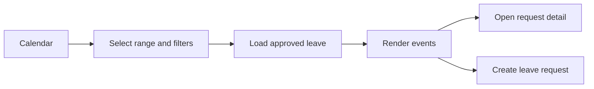

# Theo dõi lịch nghỉ

Calendar hiển thị leave đã duyệt theo tháng, tuần hoặc ngày để quản lý staffing.

## Chức năng

- Chuyển tháng trước, tháng sau và về hôm nay
- Lọc Branch, Department, Employee và Leave Type
- Chuyển Month, Week và Day view
- Click event để mở Leave Detail
- Click ngày để tạo request nếu có `LEAVE_REQUEST`
- Hiển thị staffing warning khi số người nghỉ vượt policy

## API

```text
GET /leaves?status=SCHEDULED&fromDate=:start&toDate=:end
GET /organizations/departments
```

## Screen flow



[[Nghỉ phép/Nghỉ phép - Index]]

