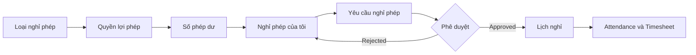

# Quản lý nghỉ phép

Module Leave tách cấu hình, entitlement, balance, request và approval. Mỗi menu con có đặc tả màn hình riêng.

## Cây menu

| Menu | Route | Tài liệu | Permission |
|---|---|---|---|
| Nghỉ phép của tôi | `/leave/my-leave` | [[Nghỉ phép/Nghỉ phép của tôi]] | `LEAVE_REQUEST` |
| Yêu cầu nghỉ phép | `/leave/requests` | [[Nghỉ phép/Yêu cầu nghỉ phép]] | `LEAVE_APPROVE` |
| Lịch nghỉ | `/leave/calendar` | [[Nghỉ phép/Lịch nghỉ]] | `LEAVE_VIEW` |
| Số phép dư | `/leave/balances` | [[Nghỉ phép/Số phép dư]] | `LEAVE_VIEW` |
| Loại nghỉ phép | `/leave/types` | [[Nghỉ phép/Loại nghỉ phép]] | `LEAVE_CONFIGURE` |
| Quyền lợi phép | `/leave/entitlements` | [[Nghỉ phép/Quyền lợi phép]] | `LEAVE_CONFIGURE` |

## Luồng tổng thể

## API hiện có

- `GET /leaves`
- `GET /leaves/:id`
- `POST /leaves`
- `POST /leaves/:id/approve`
- `POST /leaves/:id/reject`
- `POST /leaves/:id/cancel`
- `GET /leave-types`
- `GET /leave-entitlements`
- `GET /leave-balances`

[[Hospital HRM - Index]]

