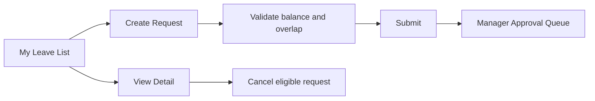

# Xem và tạo đơn nghỉ phép của tôi

Nhân viên xem lịch sử đơn, tạo đơn mới, xem chi tiết và hủy đơn còn hợp lệ.

## Chức năng

| ID | Chức năng | API | Liên kết tiếp theo |
|---|---|---|---|
| `ML-01` | Tìm theo mã hoặc lý do | `GET /leaves?employeeId=self&keyword=` | Giữ tại danh sách |
| `ML-02` | Tạo đơn phép | `POST /leaves` | Form tạo đơn, sau đó [[Nghỉ phép/Yêu cầu nghỉ phép]] |
| `ML-03` | Xem chi tiết | `GET /leaves/:id` | Leave detail drawer |
| `ML-04` | Hủy đơn | `POST /leaves/:id/cancel` | Cập nhật [[Nghỉ phép/Số phép dư]] nếu đã giữ chỗ |
| `ML-05` | Xem số dư | `GET /leave-balances?employeeId=self` | [[Nghỉ phép/Số phép dư]] |

## Table specification

| Column key | Nhãn | Width | Sort | Fixed | Nội dung |
|---|---|---:|---|---|---|
| `id` | Mã | 110 | Có | Left | Link mở detail |
| `type` | Loại phép | 140 | Có | Không | Leave type name |
| `fromDate` | Từ ngày | 120 | Có | Không | Local date |
| `toDate` | Đến ngày | 120 | Có | Không | Local date |
| `days` | Số ngày | 90 | Có | Không | Decimal day units |
| `reason` | Lý do | 200 | Không | Không | Truncate, tooltip full text |
| `status` | Trạng thái | 120 | Có | Không | Status badge |
| `actions` | Thao tác | 50 | Không | Right | View, cancel |

`fixedLeft=['id']`, `fixedRight=['actions']`.

## Row actions

- **View**: luôn khả dụng
- **Cancel**: chỉ `DRAFT`, `PENDING_APPROVAL` hoặc `SCHEDULED` theo policy
- **Duplicate**: tạo form mới từ đơn cũ, không sao chép approval

## Screen flow

[[Nghỉ phép/Nghỉ phép - Index]]

