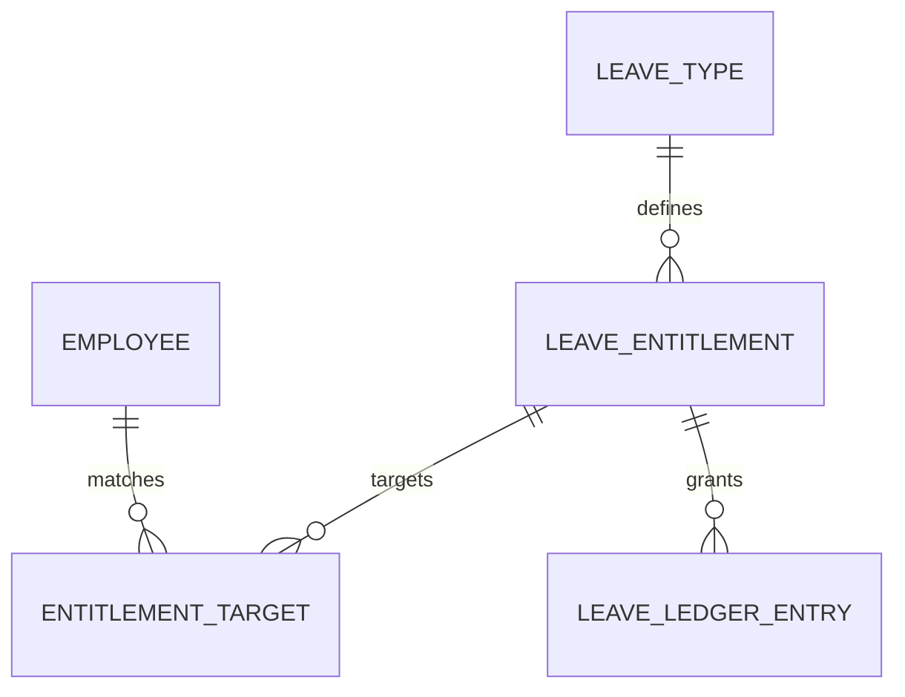

# Cấu hình quyền lợi phép

Entitlement xác định nhóm nhân viên nhận bao nhiêu đơn vị phép trong một khoảng hiệu lực.

## Table columns

| Column | Nhãn | Width | Fixed | Actions |
|---|---|---:|---|---|
| `id` | Mã | 100 | Left | Detail |
| `ruleName` | Tên chính sách | 250 | Left | Edit |
| `target` | Đối tượng áp dụng | 180 | Không | View employees |
| `leaveType` | Loại phép | 150 | Không | Filter |
| `validFrom` | Hiệu lực từ | 110 | Không | Sort |
| `validTo` | Đến ngày | 110 | Không | Sort |
| `days` | Định mức | 120 | Right | Sort |
| `status` | Trạng thái | 110 | Không | Activate/Deactivate |
| `actions` | Thao tác | 50 | Right | Edit, duplicate, deactivate |

`fixedLeft=['id','ruleName']`, `fixedRight=['days','actions']`.

## Business rules

- Rule có `effectiveFrom` và `effectiveTo`
- Không overwrite rule đã áp dụng
- Rule mới tạo version mới
- Rule trùng đối tượng dùng priority
- Balance generation phải idempotent

## Chức năng và API

| Chức năng | API | Ảnh hưởng |
|---|---|---|
| List | `GET /leave-entitlements` | Hiển thị policy version |
| Create | `POST /leave-entitlements` cần bổ sung | Tạo entitlement rule |
| Update | `PUT /leave-entitlements/:id` cần bổ sung | Tạo version mới nếu đã hiệu lực |
| Preview target | `POST /leave-entitlements/preview` cần bổ sung | Trả nhân viên bị ảnh hưởng |
| Apply | `POST /leave-entitlements/:id/apply` cần bổ sung | Cập nhật [[Nghỉ phép/Số phép dư]] |

[[Nghỉ phép/Nghỉ phép - Index]]

