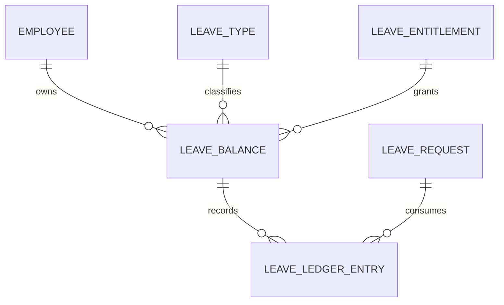

# Theo dõi số phép dư

Màn hình hiển thị entitlement, số đã dùng, số đã lên lịch và số còn lại của từng nhân viên theo loại phép và kỳ hiệu lực.

## Chức năng

| ID | Chức năng | API | Màn hình liên kết |
|---|---|---|---|
| `LB-01` | Tìm nhân viên | `GET /leave-balances?keyword=` | [[Nhân viên/Danh sách nhân viên]] khi click nhân viên |
| `LB-02` | Lọc loại phép | `GET /leave-balances?leaveTypeId=` | [[Nghỉ phép/Loại nghỉ phép]] |
| `LB-03` | Lọc kỳ và ngày hiệu lực | `GET /leave-balances?asOfDate=` | Giữ tại màn hình |
| `LB-04` | Xem lịch sử biến động | Backend cần `GET /leave-balances/:employeeId/ledger` | Balance ledger drawer |
| `LB-05` | Điều chỉnh số dư | Backend cần `POST /leave-balances/adjustments` | Approval workflow và audit |
| `LB-06` | Xuất danh sách | Backend cần `POST /leave-balances/exports` | [[Báo cáo]] |

## Table columns

| Column key | Nhãn | Width | Sort | Filter | Fixed |
|---|---|---:|---|---|---|
| `id` | Mã NV | 90 | Có | Keyword | Left |
| `employeeName` | Nhân viên | 200 | Có | Keyword | Left |
| `department` | Khoa/phòng | 160 | Có | Select | Không |
| `type` | Loại phép | 140 | Có | Select | Không |
| `period` | Kỳ hiệu lực | 130 | Có | Date | Không |
| `entitled` | Tổng ngày | 110 | Có | Không | Không |
| `carriedForward` | Chuyển từ kỳ trước | 130 | Có | Không | Không |
| `adjusted` | Điều chỉnh | 100 | Có | Không | Không |
| `used` | Đã nghỉ | 100 | Có | Không | Không |
| `scheduled` | Đã lên lịch | 110 | Có | Không | Không |
| `expired` | Hết hạn | 90 | Có | Không | Không |
| `balance` | Còn lại | 100 | Có | Range | Right |
| `actions` | Thao tác | 60 | Không | Không | Right |

Khuyến nghị: `fixedLeft=['id','employeeName']`, `fixedRight=['balance','actions']`.

## Công thức hiển thị

```text
Balance = Entitled + Carried Forward + Adjusted - Used - Scheduled - Expired
```

Frontend chỉ hiển thị kết quả backend trả về. Frontend không tự tính source of truth.

## Row actions

- View ledger
- View employee leave requests
- Add adjustment, yêu cầu `LEAVE_CONFIGURE`
- View entitlement source
- Export employee statement

## ERD



[[Nghỉ phép/Nghỉ phép - Index]]
