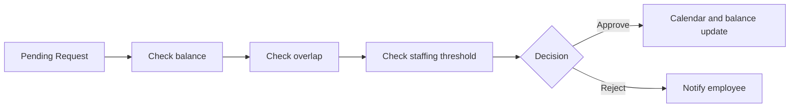

# Duyệt yêu cầu nghỉ phép

Manager và HR xem request trong phạm vi quản lý, kiểm tra xung đột rồi approve hoặc reject.

## Filter

- Keyword: employee name hoặc request code
- Status: pending, approved, rejected, cancelled
- Branch, Department, Leave Type
- From Date, To Date

## Table specification

| Column key | Nhãn | Width | Fixed | Thao tác |
|---|---|---:|---|---|
| `id` | Mã | 110 | Left | Open detail |
| `employeeName` | Nhân viên | 180 | Left | Open employee profile |
| `department` | Khoa/phòng | 150 | Không | Filter |
| `type` | Loại phép | 140 | Không | Filter |
| `fromDate` | Từ ngày | 110 | Không | Sort |
| `toDate` | Đến ngày | 110 | Không | Sort |
| `days` | Số ngày | 90 | Không | Sort |
| `status` | Trạng thái | 120 | Không | Filter |
| `actions` | Thao tác | 70 | Right | View, approve, reject |

`fixedLeft=['id','employeeName']`, `fixedRight=['actions']`.

## Actions và API

| Action | Điều kiện | API | Ảnh hưởng |
|---|---|---|---|
| View | Có `LEAVE_APPROVE` | `GET /leaves/:id` | Mở detail và approval history |
| Approve | `PENDING_APPROVAL` | `POST /leaves/:id/approve` | Cập nhật [[Nghỉ phép/Lịch nghỉ]], [[Nghỉ phép/Số phép dư]] và Attendance |
| Reject | `PENDING_APPROVAL` | `POST /leaves/:id/reject` | Giải phóng scheduled balance |
| Bulk approve | Các request hợp lệ | Backend cần `POST /leaves/bulk-approve` | Audit từng request |

## Approval flow

[[Nghỉ phép/Nghỉ phép - Index]]

