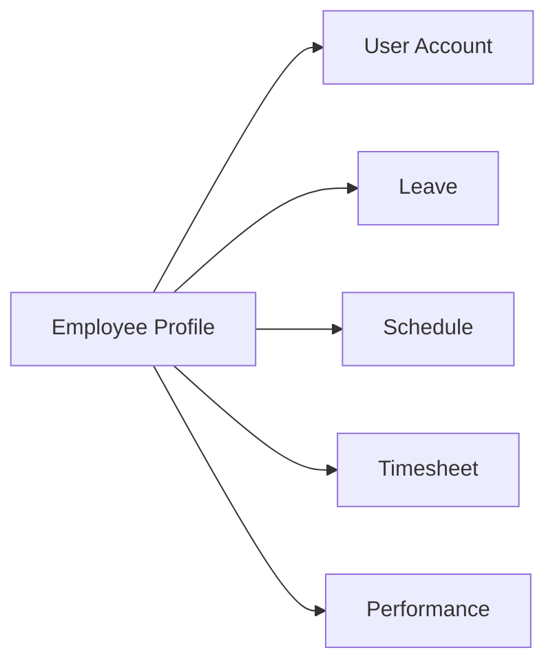

# Xem hồ sơ nhân viên

Tabs: Personal, Contact, Emergency Contacts, Job, Salary, Documents, Employment History. Mỗi tab dùng API riêng dưới `/employees/:id/*` và permission riêng cho dữ liệu nhạy cảm.

Actions: edit, upload document, change assignment, terminate, create/open user account, open leave history, open schedule và timesheet.

[[Nhân viên/Nhân viên - Index]]

