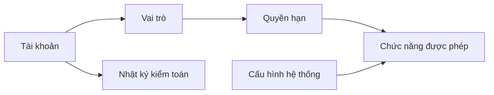

# Quản trị hệ thống

> [!info] Phạm vi
> Cấu hình bảo mật, phân quyền, truy vết và tham số vận hành dùng chung cho Hospital HRM.

## Menu con

| Menu | Route | Tài liệu | Mục tiêu |
|---|---|---|---|
| Vai trò | `/admin/roles` | [[Quản trị hệ thống/Vai trò]] | Gom nhóm quyền theo trách nhiệm nghiệp vụ |
| Quyền hạn | `/admin/permissions` | [[Quản trị hệ thống/Quyền hạn]] | Quản lý danh mục permission chuẩn |
| Nhật ký kiểm toán | `/admin/audit-logs` | [[Quản trị hệ thống/Nhật ký kiểm toán]] | Truy vết hành động và thay đổi dữ liệu |
| Cấu hình hệ thống | `/admin/settings` | [[Quản trị hệ thống/Cấu hình hệ thống]] | Quản lý tham số toàn hệ thống |

## Luồng liên kết tổng thể

## Nguyên tắc

- Component kiểm tra permission, không kiểm tra trực tiếp role.
- Thay đổi vai trò, quyền và cấu hình nhạy cảm phải có audit log.
- Permission code là định danh ổn định; không dùng nhãn hiển thị làm khóa nghiệp vụ.

## Liên kết

- [[Tài khoản người dùng/Tài khoản người dùng - Index]]
- [[Kiến trúc frontend và API]]
- [[Hospital HRM - Index]]
