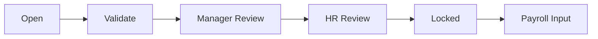

# Chốt kỳ công

Metrics: total employees, completed timesheets, pending exceptions, adjustments, OT và approvals. Actions: validate, recalculate all, manager review, HR review, lock, unlock request, send payroll.

Không lock khi còn Critical Exception, Pending Adjustment hoặc unresolved attendance. LOCKED chỉ sửa qua Unlock Request.

[[Thời gian/Thời gian - Index]]

