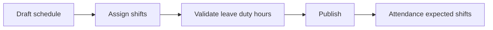

# Phân lịch làm việc

Grid fixed left gồm Employee, Department và Position; header fixed top gồm ngày. Cell hiển thị Shift, Duty, Leave, OT và conflict. Actions: assign, bulk assign, copy day/week/month, clear draft và publish.

API: `GET /workforce/schedules`, `POST /workforce/schedules`, `PUT /workforce/schedules/:id`, `POST /workforce/schedules/publish`. Publish chạy conflict detection và tạo schedule version.

[[Thời gian/Thời gian - Index]]

