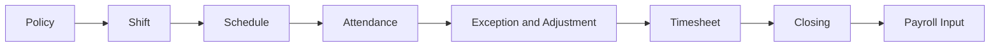

# Workforce và chấm công

| Menu | Route | Tài liệu |
|---|---|---|
| Tổng quan | `/workforce-attendance/dashboard` | [[Thời gian/Tổng quan chấm công]] |
| Ca làm việc | `/workforce-attendance/shifts` | [[Thời gian/Ca làm việc]] |
| Lịch làm việc | `/workforce-attendance/schedules` | [[Thời gian/Lịch làm việc]] |
| Trực và On-call | `/workforce-attendance/duty` | [[Thời gian/Trực và On-call]] |
| Chấm công ngày | `/workforce-attendance/daily` | [[Thời gian/Chấm công ngày]] |
| Ngoại lệ | `/workforce-attendance/exceptions` | [[Thời gian/Ngoại lệ chấm công]] |
| Điều chỉnh | `/workforce-attendance/adjustments` | [[Thời gian/Điều chỉnh chấm công]] |
| Làm thêm giờ | `/workforce-attendance/overtime` | [[Thời gian/Làm thêm giờ]] |
| Đổi ca | `/workforce-attendance/shift-swaps` | [[Thời gian/Đổi ca]] |
| Bảng công | `/workforce-attendance/timesheets` | [[Thời gian/Bảng công]] |
| Chốt công | `/workforce-attendance/closing` | [[Thời gian/Chốt công]] |
| Chính sách | `/workforce-attendance/policies` | [[Thời gian/Chính sách chấm công]] |
| Thiết bị | `/workforce-attendance/devices` | [[Thời gian/Thiết bị chấm công]] |
| Quy tắc phụ cấp | `/workforce-attendance/allowance-rules` | [[Thời gian/Quy tắc phụ cấp]] |
| Chấm công của tôi | `/workforce-attendance/my-attendance` | [[Thời gian/Chấm công của tôi]] |
| Lịch của tôi | `/workforce-attendance/my-schedule` | [[Thời gian/Lịch của tôi]] |
| Bảng công của tôi | `/workforce-attendance/my-timesheet` | [[Thời gian/Bảng công của tôi]] |
| Yêu cầu của tôi | `/workforce-attendance/my-requests` | [[Thời gian/Yêu cầu của tôi]] |

[[Hospital HRM - Index]]

